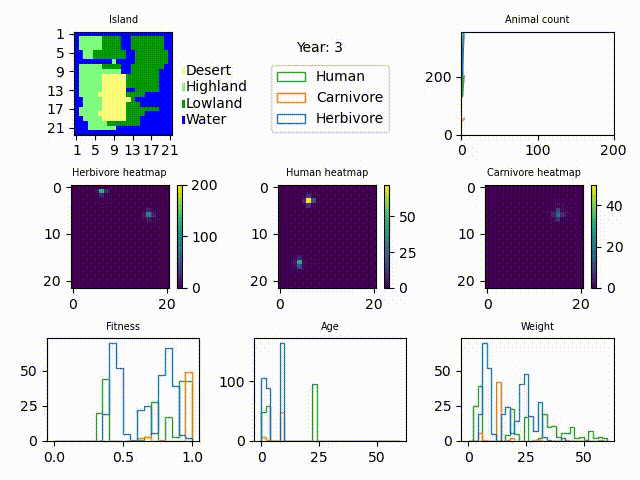

# BioSim

Simulate and visualize the lives of animals on an island.
Specify an island, add herbivores and carnivores and watch the populations develop.
 - Customizable parameters per species
 - Customizable landscape type parameters
 - Save visualization as movie

### Summary of simulation
 / ! [](docs/Images/humans.gif)


## Documenation
To simulate a 2x2 island with 10 Herbivores for 100 years
```python
geogr = "WWWW\nWLDW\nWHLW\nWWWW"
ini_pop = [{'loc': (2, 2), 
            'pop': [{
                    'species': 'Herbivore',
                    'age': 5,
                    'weight': 20
                    } for _ in range(10)]}]
sim = BioSim(geogr, ini_pop, seed=123)
sim.simulate(num_years=100)
```
For more [complete examples](examples/complete_example.py), see the `examples/` folder.
See the complete list of `BioSim` parameters in the [documentation](#documentation).

### Project Structure

 - `src/biosim` The biosim Python module, containing the core source.
 - `tests/` The test suite, see [testing](#testing).
 - `examples/` Example files showing usage of the `biosim` module
 - `docs/` Documentation source files, gives additional information not found in docstrings.
 - `src/humans` An additional python module containing an experimental `Human`-animal. See [`examples/humans_sim.py`](examples/humans_sim.py).

### Documentation

Inside `docs/` the `.rst` files contain additional descriptions
of the module and its components, as well as pulling in docstrings from the module source.
Build the docs using
```shell
cd docs
make html
```
Then read `docs/_build/html/index.html`

### Building

Build the python package using
```shell
python -m build
```

### Testing

Run all tests (with coverage) by running in the root of the repository
```shell
tox
```

### Code style
All source and test files must adhere to PEP8, with a max line length of 100.
Check using
```shell
flake8 src tests
```
