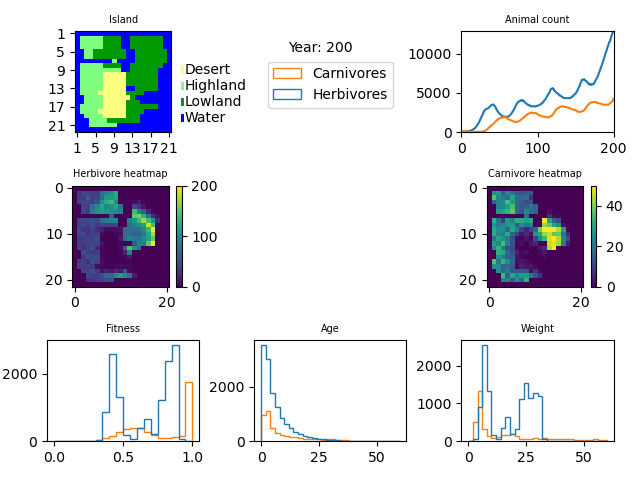

.. _biographics:

BioGraphics
==================================
BioGraphics is a subclass of the provided ``Graphics`` class.
Given the initial map, and yearly updates on the state of the ``BioSim`` instance,
it will visualize the current state, and plot historic values.

The visualization contains

 - Map of landscape types.
 - Total animal count for each species.
 - Heatmap for location of the herbivores and the carnivores.
 - Histograms for the species' distributions of fitness, ages and weights.

Example image:

Through passing extra parameters, the color limits of the heatmaps and bins of histograms
can be configured. If left to defaults, the scales automatically fit the largest values.

.. note:: If Humans are introduced, they also get included in the visualization, see :ref:`humans`.

.. autoclass:: biosim.biographics.BioGraphics
   :members:
   :inherited-members:
