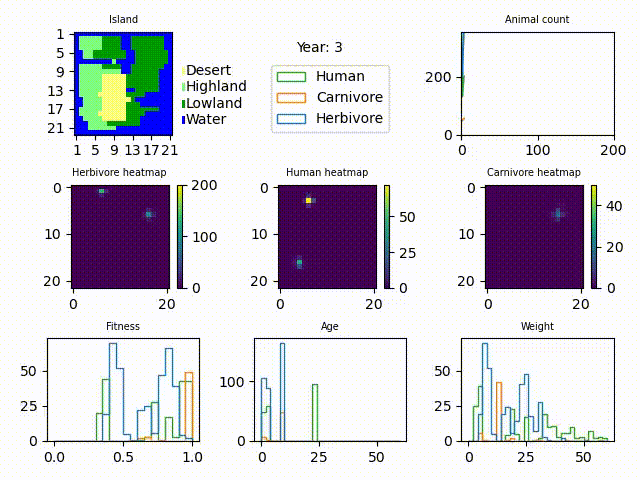

.. _humans:

Humans
==================================

``humans`` is an extra module that can be imported to extend the BioSim simulation.
``Human`` is a subclass of ``Animal`` and comes with its own default parameters, shown in the
table below. These can be user specified, and even changed during simulations, like all other animals.

For examples of using the human, see ``examples/humans_sim.py``.

Humans have the ability to eat both prey and fodder. But they are not able to
give birth until the age of 18.
They also prefer eating the fittest prey in their cell, if possible.

.. csv-table:: **Default Human Parameters**
   :header: "Parameter", "Human", "Description"
   :widths: 15, 10, 30

   ":math:`w_\text{birth}`, ``w_birth``", 5.0, "Expected value of weight of newborn"
   ":math:`\sigma_\text{birth}`, ``sigma_birth``", 0.7, "Standard deviation of weight of newborn"
   ":math:`\beta_\text{fodder}`, ``beta_fodder``", 0.75, "Weight gained in kg from eating 1 kg of fodder"
   ":math:`\beta_\text{prey}`, ``beta_prey``", 0.9, "Weight gained in kg from eating 1 kg of prey"
   ":math:`\eta`, ``eta``", 0.15, "Proportion of body weight lost each year"
   ":math:`a_\text{half}`, ``a_half``", 60, "Halfway point (from 1 to 0) on age-fitness sigmoid"
   ":math:`\phi_\text{age}`, ``phi_age``", 0.3, "Steepness of age-fitness sigmoid"
   ":math:`w_\text{half}`, ``w_half``", 10, "Halfway point (from 0 to 1) on weight-fitness sigmoid"
   ":math:`\phi_\text{weight}`, ``phi_weight``", 0.1, "Steepness of weight-fitness sigmoid"
   ":math:`\mu`, ``mu``", 0.2, "Likelihood-coefficient for trying to migrate each year. Multiplied by fitness (:math:`\phi`)"
   ":math:`\gamma`, ``gamma``", 0.2, "Likelihood-coefficient for giving birth, see :ref:`animals`"
   ":math:`\zeta`, ``zeta``", 8, "To give birth, must be :math:`\zeta` times heavier :math:`w_\text{birth} + \sigma_\text{birth}`"
   ":math:`\xi`, ``xi``", 1.1, "Weight lost giving birth is child's weight * :math:`\xi`"
   ":math:`\omega`, ``omega``", 0.3, "Likelihood-coefficient of dying each year, multiplied by :math:`(1-\phi)`."
   ":math:`F_\text{fodder}`, ``F_fodder``", 25, "Maximum weight of fodder one can eat per year"
   ":math:`F`, ``F``", 25, "Maximum weight of food one can eat per year, includes both fodder and prey"
   ":math:`\Delta\Phi_\text{max}`, ``DeltaPhiMax``", 20, "Likelihood of killing a
   prey is equal to fitness difference divided by :math:`\Delta\Phi_\text{max}`"
   ":math:`BirthAge_\text{min}`, ``BirthAge_min``", 18, "Maximum weight of food and prey one can eat per year"

.. autoclass:: humans.human.Human
   :members:
