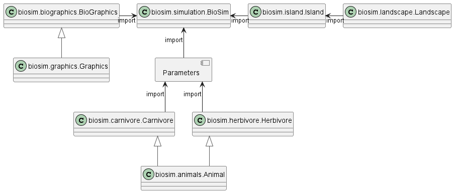

.. BioSim documentation master file, created by
   sphinx-quickstart on Fri Jun 10 17:24:44 2022.
   You can adapt this file completely to your liking, but it should at least
   contain the root `toctree` directive.

.. _index:

Welcome to BioSim's documentation!
==================================

BioSim is a package providing simulation of animals on
an island, where food is limited, and carnivores kill and eat prey.
The simulation contains simultaneous visualizations that can be saved as movies
and viewed later.

The island is divided into a grid of cells, where each cell has a type of landscape and zero or more animals.
Each simulated year is divided into 6 seasons:

 - **Feeding:** Herbivores eat fodder first, then carnivores eat prey.
   Fodder grows at the start of each year, amount of fodder depends on type of landscape.
 - **Procreation:** Animals try to give birth, depending on fitness and number of other species members.
 - **Migration:** Animals might migrate to neighboring cells, at most once per year
 - **Ageing:** Each animal becomes one year older.
 - **Loss of Weight:** All animals lose a portion of their weight.
 - **Death:** For each animal, it is determined whether the animal dies or not.

These seasons correspond to methods in ``Landscape``, see :ref:`landscape`.
For more details and exact formulas, see :ref:`animals`, :ref:`herbivore` and :ref:`carnivore`.

The following diagram shows which classes inherit from each other (big arrows),
and which modules import each other.

The architecture of the program makes ``Island`` and ``Landscape``
independent of constructing animals, instead accepting a dictionary of animal parameters.
One of the parameters is the constructor of the species' class.
This makes it possible to define new species without modifying the ``biosim`` module.
See :ref:`humans` for an example.

.. toctree::
   :maxdepth: 2
   :caption: Contents:

   biosim
   island
   landscape
   animals
   herbivore
   carnivore
   parameters
   biographics
   humans

Indices and tables
==================

* :ref:`genindex`
* :ref:`modindex`
* :ref:`search`
